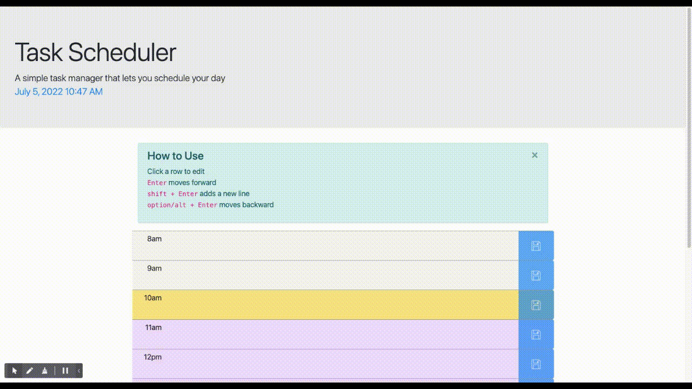
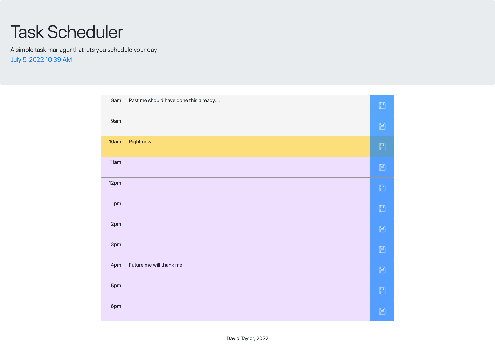
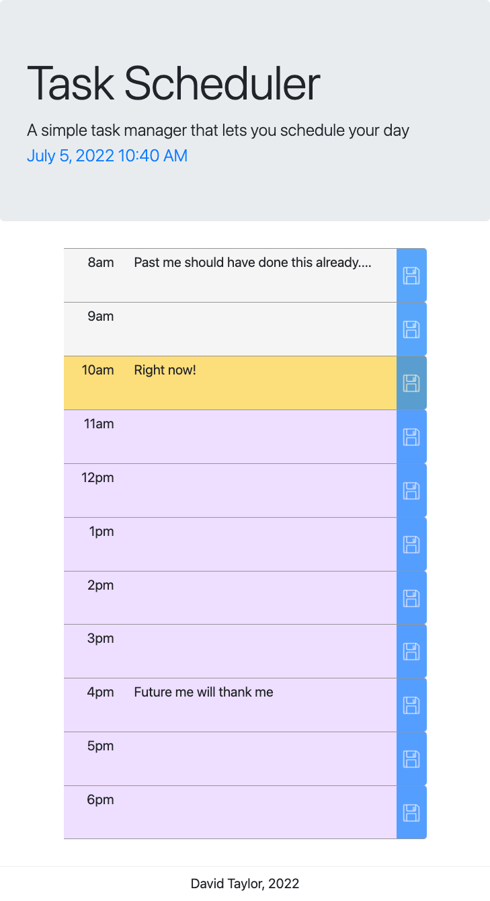
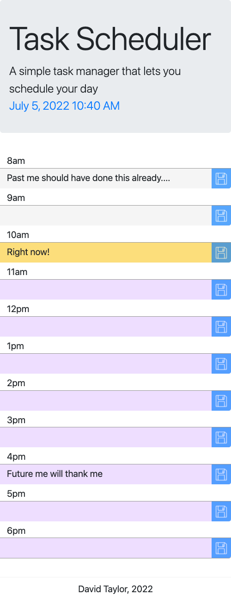

# Task Manager

This simple task scheduler allows you to save your daily routine and tracks the time throughout the day so that YOU can stay on track too!

## General Features
- Allows text descriptions of your tasks from 8am to 6pm
- Saves to local storage when user clicks `save` button
- Also autosaves data when user exits the textarea input without clicking save

## Moving Between Tasks
- Any row becomes editable when the user clicks on it
- `Enter` moves to the row of the next task
- `option/alt` + `Enter` moves to the row of the previous task
- `shift` + `Enter` adds a new line
- Upon gaining focus the entire text description is selected

## Moment.js Highlights
- Updates the time clock every minute 
- Displays the row of the current hour with light yellow background
- Displays the row of future hours with light purple background
- When the hour changes, the colors update as well

## Easy UI 
### `How to Use`
A banner is displayed that clearly describes how to use the page. The banner is dismissable and does not appear again once dismissed, even on reload.

### Built Using...
Bootstrap, jQuery and Moment.js

# Responsive Design
### Large Screen

### Medium Screen

### Small Screen
